Introduction
---------------

Comparing surgical polyp v no polyp datasets from Jose's 2018 paper
"Allergic inflammatory response"


Chapter 1: Loading data to Seurat
---------------

Load libraries

```r
library(tidyverse)
library(Seurat)
library(Matrix)
```


```r
umifile <- read.csv(file="PolypALL.csv",header=TRUE,stringsAsFactors=FALSE)
umidata <- umifile %>% remove_rownames %>% column_to_rownames(colnames(umifile)[1])
#subset for testing
umidata <- umidata %>% select(starts_with(c("Polyp1TOT","Polyp3TOT")))
rm(umifile)

#load patient information
metadata <- read.csv("polypMetadata.csv")
#reduce metadata table to data you actually have
metadata <- metadata[1:12,]

#Need a metadata row for each cell, not for each patient.
metadatalist = NULL
for (id in metadata$orig.ident){
	meta <- data.frame(patient = rep(id,length(umidata %>% select(starts_with(id)))), row.names=colnames(umidata %>% select(starts_with(id))))
	metadatalist = bind_rows(metadatalist,meta)
}
metadatalist <- metadatalist %>% left_join(metadata,by=c("patient"="orig.ident"))
polypstatus <- metadatalist %>% select(polyp)
#sparsify the dataset
umisparse <- umidata %>% data.matrix %>% Matrix(sparse=TRUE)
rm(umidata)

polyp <- CreateSeuratObject(umisparse, meta.data = polypstatus, project = "polyp_scRNAseq")

#use [[]] puts a new metadata column to the seurat object
polyp[["percent.mt"]] <- PercentageFeatureSet(polyp, pattern = "^MT-")

#look at metadata summaries of seurat object
head(polyp@meta.data, 5)
```

```
##             orig.ident nCount_RNA nFeature_RNA polyp percent.mt
## Polyp1TOT_1  Polyp1TOT       9821         3137  <NA>   1.293147
## Polyp1TOT_2  Polyp1TOT       9064         2915  <NA>   2.912621
## Polyp1TOT_3  Polyp1TOT       8293         2517  <NA>   6.451224
## Polyp1TOT_4  Polyp1TOT      10003         3616  <NA>   3.668899
## Polyp1TOT_5  Polyp1TOT       8003         2823  <NA>   1.686867
```

Chapter 2: Subsetting and Normalization
---------------
Using log n+1 (log1p()) transform normalization.


```r
polyp <- NormalizeData(polyp, normalization.method = "LogNormalize", scale.factor = 100000)
```

Now we can split the dataset

```r
#Split dataset by polyp status
polyp.list <- SplitObject(polyp, split.by = "orig.ident")
```

Next, we pick out the most variable genes from each subset of the dataset.

```r
polyp.list <- lapply(X = polyp.list, FUN = function(x) {
    x <- FindVariableFeatures(x, selection.method = "vst", nfeatures = 2000)
})
```

Next, find anchors, pairs of cells from each dataset that are contained within each other's neighborhoods (aka mutual nearest neighbours) (Stuart, Butler et al Cell 2019)

```r
#pick a number of dimensions to work with
z=12
anchors <- FindIntegrationAnchors(object.list = polyp.list, dims=1:z)
```

```
## Computing 2000 integration features
```

```
## Scaling features for provided objects
```

```
## Finding all pairwise anchors
```

```
## Running CCA
```

```
## Merging objects
```

```
## Finding neighborhoods
```

```
## Finding anchors
```

```
## 	Found 1792 anchors
```

```
## Filtering anchors
```

```
## 	Retained 1496 anchors
```

```r
#Integrate the data
integratedpolyp <- IntegrateData(anchorset=anchors, dims=1:z)
```

```
## Merging dataset 1 into 2
```

```
## Extracting anchors for merged samples
```

```
## Finding integration vectors
```

```
## Finding integration vector weights
```

```
## Integrating data
```

```
## Warning: Adding a command log without an assay associated with it
```

Chapter 3: Data scaling and visualizing dimensionality reduction
---------------

Seurat uses a "ScaleData" function:
  - shift the expression of each gene so that mean expression across cells is 0
  - scale the expression of each gene, so that the variance across cells is 1


```r
all.genes <- rownames(polyp)
integratedpolyp <- ScaleData(integratedpolyp, features=all.genes, vars.to.regress=NULL)
```

```
## Centering and scaling data matrix
```


PCA

```r
integratedpolyp <- RunPCA(integratedpolyp, npcs=z, verbose=FALSE)
```

Visualize PCA in several different ways

First, let's look at the highest contributing genes to each component

```r
VizDimLoadings(integratedpolyp, dims = 1:z, reduction = "pca") & theme(axis.text.y = element_text(size=5))
```

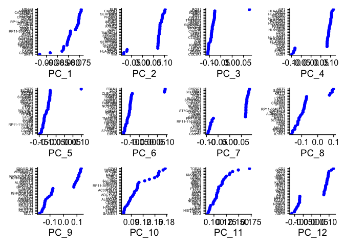<!-- -->

And we can look at the distribution of cells by the components we like, e.g.

```r
DimPlot(integratedpolyp, reduction = "pca")
```

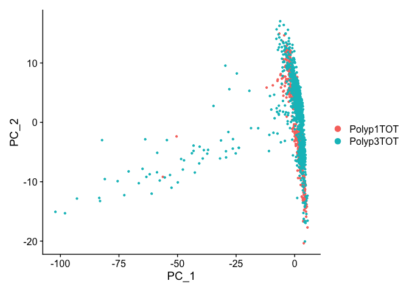<!-- -->

Or look at heatmaps for the biggest gene contributors across cells

```r
DimHeatmap(integratedpolyp, dims = z-1, cells = 500, balanced = TRUE)
```

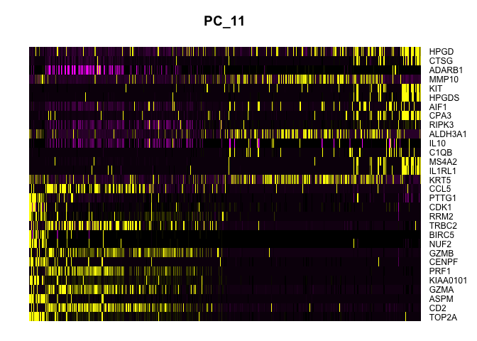<!-- -->

There are 10 main cell types defined in the paper:

basal (KRT5 (Peter Lofty presentation subpopulation of basal KRT15))
apical (KRT8)
glandular (LTF)
ciliated (FOXJ1)
fibroblast (COL1A2)
endothelial (DARC/ACKR1)
plasma cell (CD79A)
T cell (TRBC2)
myeloid (HLA-DRA)
mast cell (TPSAB1)

Chapter 4: Clustering the cells with UMAP and t-sne
-------------


```r
integratedpolyp <- FindNeighbors(integratedpolyp, dims = 1:z)
```

```
## Computing nearest neighbor graph
```

```
## Computing SNN
```

```r
integratedpolyp <- FindClusters(integratedpolyp, resolution = 0.25)
```

```
## Modularity Optimizer version 1.3.0 by Ludo Waltman and Nees Jan van Eck
## 
## Number of nodes: 2069
## Number of edges: 63532
## 
## Running Louvain algorithm...
## Maximum modularity in 10 random starts: 0.9463
## Number of communities: 11
## Elapsed time: 0 seconds
```

Plot~!

```r
integratedpolyp <- RunUMAP(integratedpolyp, dims = 1:z)
```

```
## Warning: The default method for RunUMAP has changed from calling Python UMAP via reticulate to the R-native UWOT using the cosine metric
## To use Python UMAP via reticulate, set umap.method to 'umap-learn' and metric to 'correlation'
## This message will be shown once per session
```

```
## 14:36:06 UMAP embedding parameters a = 0.9922 b = 1.112
```

```
## 14:36:06 Read 2069 rows and found 12 numeric columns
```

```
## 14:36:06 Using Annoy for neighbor search, n_neighbors = 30
```

```
## 14:36:06 Building Annoy index with metric = cosine, n_trees = 50
```

```
## 0%   10   20   30   40   50   60   70   80   90   100%
```

```
## [----|----|----|----|----|----|----|----|----|----|
```

```
## **************************************************|
## 14:36:06 Writing NN index file to temp file /var/folders/ck/vn04kr2d30v0dvs29yy8kngh0000gp/T//RtmpboECz3/fileff8c5fa23fe
## 14:36:06 Searching Annoy index using 1 thread, search_k = 3000
## 14:36:07 Annoy recall = 100%
## 14:36:07 Commencing smooth kNN distance calibration using 1 thread
## 14:36:07 Initializing from normalized Laplacian + noise
## 14:36:08 Commencing optimization for 500 epochs, with 83804 positive edges
## 14:36:10 Optimization finished
```

```r
DimPlot(integratedpolyp, reduction = "umap", label=TRUE)
```

```
## Warning: Using `as.character()` on a quosure is deprecated as of rlang 0.3.0.
## Please use `as_label()` or `as_name()` instead.
## This warning is displayed once per session.
```

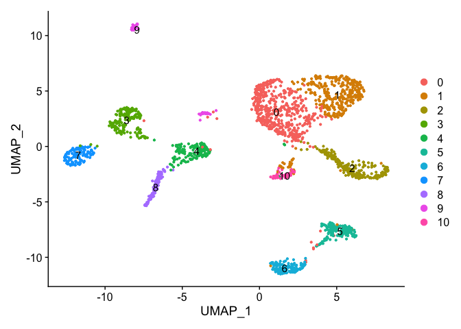<!-- -->

```r
DimPlot(integratedpolyp, reduction= "umap", group.by="orig.ident")
```

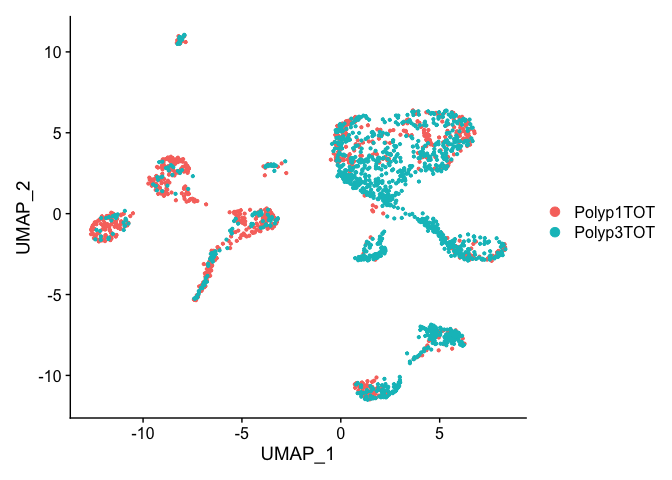<!-- -->

```r
DimPlot(integratedpolyp, reduction= "umap", split.by="orig.ident")
```

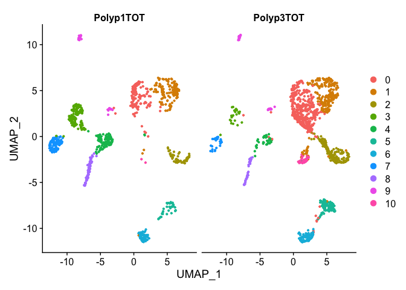<!-- -->

```r
#to point out where your favorite genes are living
FeaturePlot(integratedpolyp, features = c("KRT5", "KRT8", "LTF", "FOXJ1", "COL1A2", "DARC","CD79A","TRBC2","HLA-DRA","TPSAB1")) & NoAxes() & NoLegend() & theme(plot.title = element_text(size=8))
```

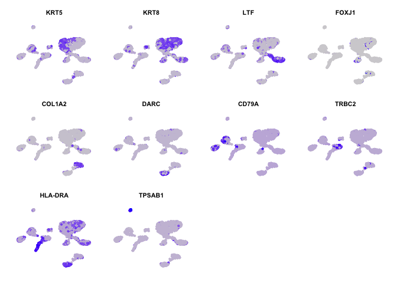<!-- -->

```r
#Markers that are different between polyp status
FeaturePlot(integratedpolyp, features = c("KRT5", "KRT8", "LTF", "CD79A","HLA-DRA"), split.by="orig.ident") & NoAxes() & NoLegend() & theme(plot.title = element_text(size=8))
```

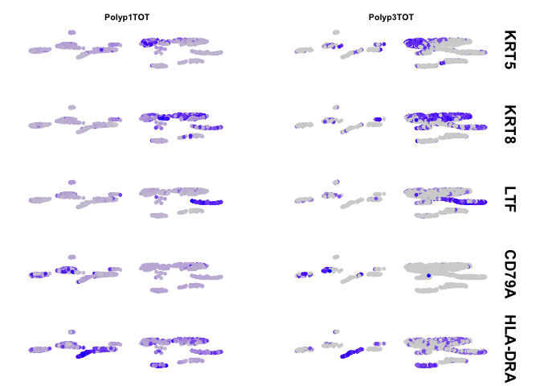<!-- -->


Chapter 5: Mapping cell types by markers
-------------

basal (KRT5)
apical (KRT8)
glandular (LTF)
ciliated (FOXJ1)
fibroblast (COL1A2)
endothelial (DARC)
plasma cell (CD79A)
T cell (TRBC2)
myeloid (HLA-DRA)
mast cell (TPSAB1)


```r
#Identify conserved cell marker types across conditions, one cluster at a time (default method "metap::minimump")
DefaultAssay(integratedpolyp) <- "RNA"
pmarkers <- FindConservedMarkers(integratedpolyp, ident.1= 3, grouping.var="orig.ident")
```

```
## Testing group Polyp1TOT: (3) vs (6, 1, 10, 7, 9, 2, 8, 0, 5, 4)
```

```
## Testing group Polyp3TOT: (3) vs (10, 2, 1, 6, 0, 9, 7, 8, 5, 4)
```

```r
head(pmarkers)
```

```
##              Polyp1TOT_p_val Polyp1TOT_avg_logFC Polyp1TOT_pct.1
## IGKC           9.197552e-141            3.955965           0.868
## FCRL5           6.774789e-33            1.760065           0.424
## IGKV1OR2-108    1.413605e-83            4.594258           0.507
## AC096579.7      5.273683e-83            4.228576           0.688
## IGKV1-6         1.450240e-64            4.737610           0.410
## IGKV1-5         2.273975e-74            4.416476           0.535
##              Polyp1TOT_pct.2 Polyp1TOT_p_val_adj Polyp3TOT_p_val
## IGKC                   0.026       2.854184e-136    2.335117e-29
## FCRL5                  0.066        2.102352e-28    1.113875e-87
## IGKV1OR2-108           0.007        4.386698e-79    1.858898e-33
## AC096579.7             0.057        1.636529e-78    2.569445e-79
## IGKV1-6                0.008        4.500386e-60    7.302036e-77
## IGKV1-5                0.024        7.056600e-70    5.594890e-76
##              Polyp3TOT_avg_logFC Polyp3TOT_pct.1 Polyp3TOT_pct.2
## IGKC                    6.004559           0.958           0.192
## FCRL5                   3.124730           0.667           0.013
## IGKV1OR2-108            2.154674           0.125           0.000
## AC096579.7              5.631205           0.542           0.009
## IGKV1-6                 5.047012           0.333           0.001
## IGKV1-5                 5.328935           0.292           0.000
##              Polyp3TOT_p_val_adj     max_pval minimump_p_val
## IGKC                7.246334e-25 2.335117e-29  1.839510e-140
## FCRL5               3.456576e-83 6.774789e-33   2.227749e-87
## IGKV1OR2-108        5.768532e-29 1.858898e-33   2.827209e-83
## AC096579.7          7.973502e-75 2.569445e-79   1.054737e-82
## IGKV1-6             2.265968e-72 1.450240e-64   1.460407e-76
## IGKV1-5             1.736206e-71 2.273975e-74   1.118978e-75
```

```r
#Identify biomarkers using Wilcoxon rank test (many other options available)
integratedpolyp.markers <- FindAllMarkers(integratedpolyp, only.pos = TRUE, min.pct = 0.25, logfc.threshold = 0.25)
```

```
## Calculating cluster 0
```

```
## Calculating cluster 1
```

```
## Calculating cluster 2
```

```
## Calculating cluster 3
```

```
## Calculating cluster 4
```

```
## Calculating cluster 5
```

```
## Calculating cluster 6
```

```
## Calculating cluster 7
```

```
## Calculating cluster 8
```

```
## Calculating cluster 9
```

```
## Calculating cluster 10
```

```r
#print the best markers, by log(FC)
integratedpolyp.markers %>% group_by(cluster) %>% top_n(n = 1, wt = avg_logFC) -> biomarkers
biomarkers <- unlist(as.list(biomarkers$gene))

#Take the top biomarkers per cluster and plot in the UMAP
plottop <- FeaturePlot(integratedpolyp, features = biomarkers, pt.size=0.25)
plottop & NoAxes() & NoLegend() & theme(plot.title = element_text(size=8))
```

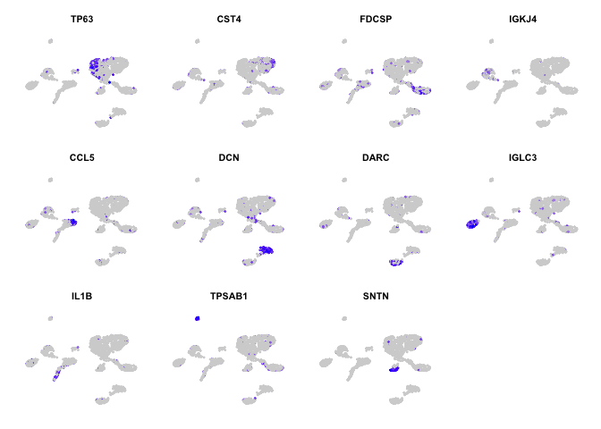<!-- -->

```r
#by (lowest) p-value
integratedpolyp.markers %>% group_by(cluster) %>% top_n(n = -1, wt = p_val) -> biomarkers
biomarkers <- unlist(as.list(biomarkers$gene))
plottop <- FeaturePlot(integratedpolyp, features = c(biomarkers,"IGKC"), pt.size=0.25)
plottop & NoAxes() & NoLegend() & theme(plot.title = element_text(size=8))
```

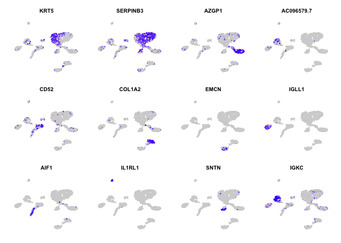<!-- -->

```r
#label clusters based on classic biomarkers.
classic.biomarkers <- data.frame(row.names=c("KRT5","KRT8","LTF","FOXJ1","COL1A2","DARC","CD79A","TRBC2","HLA-DRA","TPSAB1"),celltype=c("Basal","Apical","Glandular","Ciliated","Fibroblast","Endothelial","Plasma_Cell","T_Cell","Myeloid","Mast_Cell"))

#Find cluster ID most associated with classic biomarkers, rename 
classic.biomarkers$clusterID <- integratedpolyp.markers[rownames(classic.biomarkers),]$cluster
classic.biomarkers <- classic.biomarkers %>% group_by(clusterID) %>% summarise(celltype=toString(celltype))
```

```
## `summarise()` ungrouping output (override with `.groups` argument)
```

```r
classic.biomarkers <- classic.biomarkers %>% complete(clusterID) %>% data.frame 
classic.biomarkers$newbiomarkers <- paste(biomarkers,"characterized cells")
#replace unknown cluster IDs with top biomarker
classic.biomarkers <- classic.biomarkers %>% mutate(celltype=coalesce(celltype,newbiomarkers))

IdentityRenamingList <- split(classic.biomarkers$celltype,classic.biomarkers$clusterID)

integratedpolyp <- RenameIdents(integratedpolyp, IdentityRenamingList)

DimPlot(integratedpolyp, reduction = "umap", label = TRUE, pt.size = 0.5, split.by="orig.ident") + NoLegend() + labs(title = "Annotated Cell Types")
```

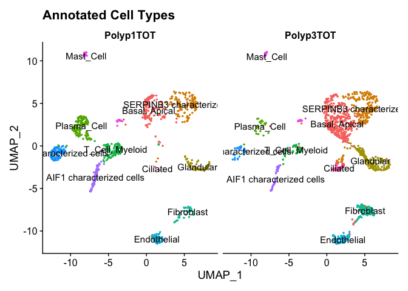<!-- -->

```r
#Next we will do a dot plot showing the differences in certain markers between polyp and non-polyp, in this case first canonical markers then highest expressed per cluster by wilcoxon rank test
markers.to.plot <- unique(c("KRT5","KRT8","LTF","FOXJ1","COL1A2","DARC","CD79A","TRBC2","HLA-DRA","TPSAB1",unlist(as.list((integratedpolyp.markers %>% group_by(cluster) %>% top_n(n=2,wt=avg_logFC))$gene))))

DotPlot(integratedpolyp,features=rev(markers.to.plot),cols=c('blue','red'),dot.scale=8, split.by="orig.ident") + RotatedAxis()
```

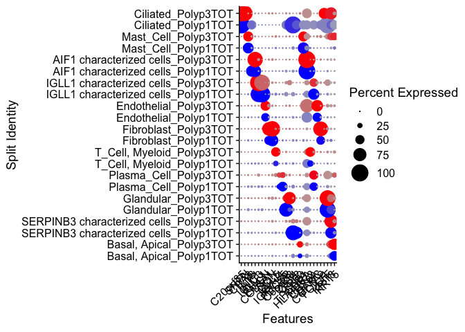<!-- -->


Chapter 6: Comparing UMAP with t-SNE
------------


```r
integratedpolyp <- RunTSNE(integratedpolyp, dims= 1:z)
plt1 <- DimPlot(integratedpolyp, reduction = "tsne",label=TRUE, pt.size=0.2, split.by="orig.ident")
plt2 <- DimPlot(integratedpolyp,reduction="umap",label=TRUE, pt.size=0.2, split.by="orig.ident")
plt1
```

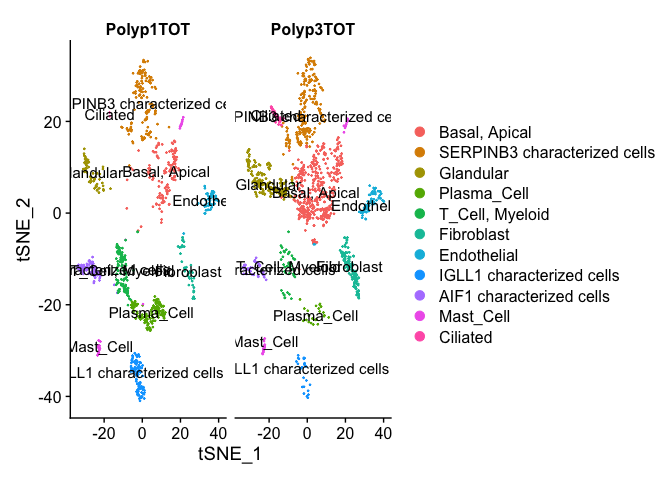<!-- -->

```r
plt2
```

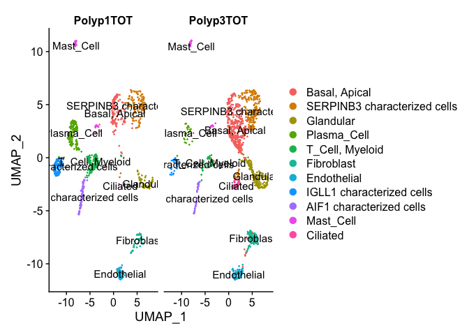<!-- -->

Need to test out Seurat's t-sne parameters.

To save your end plot, run this:

saveRDS(polyp, file = "../polyp_tutorial.rds")


Till next time~
