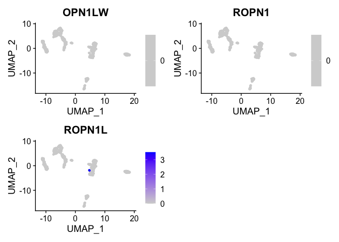
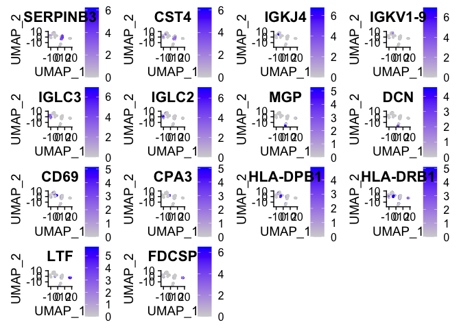

Introduction
---------------

Just testing out Seurat using the nasal polyp dataset from Jose's 2018 paper
Allergic inflammatory response


Chapter 1: Loading data to Seurat
---------------

Load libraries

```r
library(tidyverse)
library(Seurat)
```


```r
umifile <- read.csv(file="500sampPandasGenePolyp.txt",header=TRUE,stringsAsFactors=FALSE)
umidata <- umifile %>% remove_rownames %>% column_to_rownames(colnames(umifile)[1])

#grep rownames to find genes of interest - in this example opsins
umidata %>% filter(grepl("OPN1",row.names(umidata))) %>% rownames
```

```
## [1] "OPN1SW"     "ROPN1L"     "OPN1LW"     "ROPN1"      "ROPN1B"    
## [6] "ROPN1L-AS1"
```

```r
polyp <- CreateSeuratObject(umidata, project = "polyp_scRNAseq")

#look at specific genes in the seurat object
polyp[c("OPN1LW", "ROPN1", "ROPN1L"), 1:30]
```

```
## An object of class Seurat 
## 3 features across 30 samples within 1 assay 
## Active assay: RNA (3 features, 0 variable features)
```

```r
#use [[]] puts a new metadata column to the seurat object
polyp[["percent.mt"]] <- PercentageFeatureSet(polyp, pattern = "^MT-")

#look at metadata summaries of seurat object
head(polyp@meta.data, 5)
```

```
##             orig.ident nCount_RNA nFeature_RNA percent.mt
## Polyp1TOT_1  Polyp1TOT       9821         3137   1.293147
## Polyp1TOT_2  Polyp1TOT       9064         2915   2.912621
## Polyp1TOT_3  Polyp1TOT       8293         2517   6.451224
## Polyp1TOT_4  Polyp1TOT      10003         3616   3.668899
## Polyp1TOT_5  Polyp1TOT       8003         2823   1.686867
```


```r
#print violin plots of mitochondrial genes
VlnPlot(polyp, features = c("nFeature_RNA", "nCount_RNA", "percent.mt"), ncol = 3)
```

<!-- -->

```r
#more QC comparisons
plot1 <- FeatureScatter(polyp, feature1 = "nCount_RNA", feature2 = "percent.mt")
plot2 <- FeatureScatter(polyp, feature1 = "nCount_RNA", feature2 = "nFeature_RNA")
plot1 + plot2
```

<!-- -->

Chapter 2: Normalization
---------------
First, I'm following the seurat vignette and just using log transform normalization. I want to try Sanity later.


```r
polyp <- NormalizeData(polyp, normalization.method = "LogNormalize", scale.factor = 10000)
```

Next, we pick out the most variable genes from the dataset.

```r
polyp <- FindVariableFeatures(polyp, selection.method = "vst", nfeatures = 2000)

#what are the top 10?
top10 <- head(VariableFeatures(polyp), 10)

#and plot those highly variable genes with and without labels
plot1 <- VariableFeaturePlot(polyp)
plot2 <- LabelPoints(plot = plot1, points = top10, repel = TRUE)
```

```
## When using repel, set xnudge and ynudge to 0 for optimal results
```

```r
#remove legend from first plot and y-axis shit from second
plot1 + theme(legend.position="none") + plot2 + theme(axis.text.y=element_blank())+ylab("") + scale_y_discrete(breaks=NULL)
```

<!-- -->

Chapter 3: Data scaling and visualizing dimensionality reduction
---------------

Seurat uses a "ScaleData" function:
  - shift the expression of each gene so that mean expression across cells is 0
  - scale the expression of each gene, so that the variance across cells is 1


```r
all.genes <- rownames(polyp)
polyp <- ScaleData(polyp, features = all.genes)
```

```
## Centering and scaling data matrix
```

And next, let's perform PCA

```r
polyp <- RunPCA(polyp, features = VariableFeatures(object = polyp))
```

```
## PC_ 1 
## Positive:  SERPINB3, AGR2, ALOX15, PRSS23, HSPB1, KRT8, SERPINB4, CST4, KRT18, CST2 
## 	   WFDC2, SLC6A14, CST1, TSPAN1, CTD-2319I12.1, CXCL17, C19orf33, CLDN7, SLPI, AQP3 
## 	   HS3ST1, S100P, GSN, VMO1, MT1X, HES1, GABRP, PIGR, DSP, ASS1 
## Negative:  ENAM, IGHA2, IGLL1, IGLC7, IGLC3, GPR183, GUSBP11, AC096579.7, HLA-DPA1, IGHG1 
## 	   IGLV3-1, IGHG2, IGLC2, IFI30, IGHV3OR16-12, FGL2, IGHG4, IGHV3-23, IGHV3-48, IGLL5 
## 	   IGHV3-49, IGHV3-64, IGHV3-11, HLA-DQA1, IGKV1OR2-108, TTC26, PLEK, MS4A6A, IGHV3-20, IGHV3-72 
## PC_ 2 
## Positive:  SLPI, SERPINB3, AGR2, VMO1, CST4, WFDC2, TFF3, CXCL17, SLC6A14, CST1 
## 	   ALOX15, PIGR, KRT8, KRT18, CST2, S100P, SERPINB4, BPIFB1, TSPAN1, PRSS23 
## 	   SLC31A1, CLDN7, HS3ST1, SLC26A2, BPIFA1, CTD-2319I12.1, MUC5AC, C19orf33, GABRP, LCN2 
## Negative:  IGFBP7, A2M, MGP, CALD1, SPARC, FGF7, COL1A2, IFITM3, GNG11, COL3A1 
## 	   CPE, DCN, CXCL12, ELTD1, CRABP2, SERPING1, RGS5, APOD, SPARCL1, PPAP2B 
## 	   COL6A2, ESAM, EMCN, TAGLN, CXCL14, LAMA4, TPM2, RARRES2, COL15A1, TIMP3 
## PC_ 3 
## Positive:  HLA-DRB5, AIF1, HLA-DRB1, HLA-DPB1, MS4A6A, F13A1, HLA-DRA, TYROBP, HLA-DQB1, IFI30 
## 	   HLA-DQA1, HLA-DPA1, IL1B, MNDA, FGL2, C1QC, CD14, CD83, HLA-DMA, CPVL 
## 	   IL8, C5AR1, C1QB, MAFB, FCGR3A, CD163, CD68, LCP1, CCL24, GPR183 
## Negative:  ENAM, IGHG4, IGLL1, IGHG3, GUSBP11, AC096579.7, IGLC3, IGLC7, IGHA2, IGHG1 
## 	   IGHV3-23, IGHG2, IGLC2, DCN, IGHV3-43, IGKV1OR2-108, IGLL5, IGHV3-48, IGHV3-64, IGHV3-49 
## 	   IGLV3-1, COL1A2, IGHV3-11, FBLN1, IGKV1-6, IGHV3-9, IGHV3-72, IGLV2-14, IGKV1-5, FGF7 
## PC_ 4 
## Positive:  DCN, CPE, FGF7, CXCL14, CRABP2, FBLN1, KCNE4, LUM, RARRES2, SFRP2 
## 	   CRABP1, SCG2, APOD, COL1A2, COL8A1, ITGBL1, COL6A3, MFAP4, COL6A2, SLC16A2 
## 	   COL3A1, HTRA3, TMEM176A, ENPP2, C7, THY1, TWIST1, RGS4, SPON1, APOE 
## Negative:  SPARCL1, ELTD1, DARC, EMCN, A2M, CLDN5, PLVAP, RAMP3, RAMP2, JAM2 
## 	   TGFBR2, EGFL7, TSPAN7, GNG11, CD34, RDX, GIMAP7, MCTP1, ESAM, APOLD1 
## 	   MEOX1, ECSCR, VWF, SELE, LDB2, ABCB1, GIMAP5, HYAL2, ADAMTS9, PTPRB 
## PC_ 5 
## Positive:  LTF, DMBT1, TCN1, AZGP1, ODAM, FDCSP, PIGR, RNASE1, LYZ, CCL28 
## 	   BPIFB3, RARRES1, ZG16B, BPIFB1, RP11-1143G9.4, PPP1R1B, LCN2, BPIFA1, SLPI, SAA2 
## 	   SAA1, SCGB3A1, ALDH1A3, CES1, FAM3D, CXCL17, SMR3A, MIA, CLDN10, CLU 
## Negative:  CENPF, KIAA0101, NUSAP1, MKI67, TOP2A, UBE2C, NUF2, C19orf33, SERPINB3, S100A2 
## 	   KRT17, UBE2T, TK1, CDCA2, CDK1, SPC25, ANLN, TPX2, HIST1H2AJ, AURKB 
## 	   KRT5, STMN1, SFN, MT1X, HIST1H1B, SERPINB4, POSTN, BUB1B, LGALS7B, ASPM
```

We can visualize PCA in several different ways

First, let's look at the highest contributing genes to each component

```r
VizDimLoadings(polyp, dims = 1:5, reduction = "pca")
```

<!-- -->

And we can look at the distribution of cells by the components we like

```r
DimPlot(polyp, reduction = "pca")
```

<!-- -->

Or look at heatmaps for the biggest gene contributors across cells

```r
DimHeatmap(polyp, dims = 1, cells = 499, balanced = TRUE)
```

<!-- -->

For any number of components

```r
DimHeatmap(polyp, dims = 1:9, cells = 499, balanced = TRUE)
```

<!-- -->

Chapter 4: How many useful dimensions are in the dataset?
-------------
Seurat uses Macosko et al 2015 method of choosing number of important dimensions,
where PCA is run many times on 1% of the dataset, like bootstrapping.

```r
#run the bootstrap
polyp <- JackStraw(polyp, num.replicate = 100)
#score the resulting dimensions
polyp <- ScoreJackStraw(polyp, dims = 1:20)

#and plot distribution of p-values for each component
JackStrawPlot(polyp, dims = 1:20)
```

```
## Warning: Removed 31369 rows containing missing values (geom_point).
```

<!-- -->

```r
#also create an elbow plot of the variance explained by each component
ElbowPlot(polyp)
```

<!-- -->

Hard to tell whether to cut off at 5 or at 13 so I'll try both.

Chapter 5: Clustering the cells with UMAP and t-sne
-------------


```r
polyp <- FindNeighbors(polyp, dims = 1:5)
```

```
## Computing nearest neighbor graph
```

```
## Computing SNN
```

```r
polyp <- FindClusters(polyp, resolution = 0.5)
```

```
## Modularity Optimizer version 1.3.0 by Ludo Waltman and Nees Jan van Eck
## 
## Number of nodes: 499
## Number of edges: 12876
## 
## Running Louvain algorithm...
## Maximum modularity in 10 random starts: 0.8783
## Number of communities: 7
## Elapsed time: 0 seconds
```

```r
head(Idents(polyp), 5)
```

```
## Polyp1TOT_1 Polyp1TOT_2 Polyp1TOT_3 Polyp1TOT_4 Polyp1TOT_5 
##           3           1           1           1           1 
## Levels: 0 1 2 3 4 5 6
```

Plot~!

```r
polyp <- RunUMAP(polyp, dims = 1:5)
```

```
## Warning: The default method for RunUMAP has changed from calling Python UMAP via reticulate to the R-native UWOT using the cosine metric
## To use Python UMAP via reticulate, set umap.method to 'umap-learn' and metric to 'correlation'
## This message will be shown once per session
```

```
## 15:08:31 UMAP embedding parameters a = 0.9922 b = 1.112
```

```
## 15:08:31 Read 499 rows and found 5 numeric columns
```

```
## 15:08:31 Using Annoy for neighbor search, n_neighbors = 30
```

```
## 15:08:31 Building Annoy index with metric = cosine, n_trees = 50
```

```
## 0%   10   20   30   40   50   60   70   80   90   100%
```

```
## [----|----|----|----|----|----|----|----|----|----|
```

```
## **************************************************|
## 15:08:31 Writing NN index file to temp file /var/folders/5c/vpl08snd01q_n45nt4dpmw880000gn/T//RtmpJN1U7j/file1d3a6c4318cc
## 15:08:31 Searching Annoy index using 1 thread, search_k = 3000
## 15:08:31 Annoy recall = 100%
## 15:08:32 Commencing smooth kNN distance calibration using 1 thread
## 15:08:32 Initializing from normalized Laplacian + noise
## 15:08:32 Commencing optimization for 500 epochs, with 19044 positive edges
## 15:08:33 Optimization finished
```

```r
DimPlot(polyp, reduction = "umap")
```

<!-- -->

Looks bad with 5. Now with 13 components


```r
polyp <- FindNeighbors(polyp, dims = 1:13)
```

```
## Computing nearest neighbor graph
```

```
## Computing SNN
```

```r
polyp <- FindClusters(polyp, resolution = 0.5)
```

```
## Modularity Optimizer version 1.3.0 by Ludo Waltman and Nees Jan van Eck
## 
## Number of nodes: 499
## Number of edges: 11608
## 
## Running Louvain algorithm...
## Maximum modularity in 10 random starts: 0.8838
## Number of communities: 7
## Elapsed time: 0 seconds
```

```r
head(Idents(polyp), 13)
```

```
##  Polyp1TOT_1  Polyp1TOT_2  Polyp1TOT_3  Polyp1TOT_4  Polyp1TOT_5  Polyp1TOT_6 
##            3            0            0            0            0            2 
##  Polyp1TOT_7  Polyp1TOT_8  Polyp1TOT_9 Polyp1TOT_10 Polyp1TOT_11 Polyp1TOT_12 
##            0            2            0            2            6            2 
## Polyp1TOT_13 
##            6 
## Levels: 0 1 2 3 4 5 6
```

Plot~!

```r
polyp <- RunUMAP(polyp, dims = 1:13)
```

```
## 15:08:34 UMAP embedding parameters a = 0.9922 b = 1.112
```

```
## 15:08:34 Read 499 rows and found 13 numeric columns
```

```
## 15:08:34 Using Annoy for neighbor search, n_neighbors = 30
```

```
## 15:08:34 Building Annoy index with metric = cosine, n_trees = 50
```

```
## 0%   10   20   30   40   50   60   70   80   90   100%
```

```
## [----|----|----|----|----|----|----|----|----|----|
```

```
## **************************************************|
## 15:08:34 Writing NN index file to temp file /var/folders/5c/vpl08snd01q_n45nt4dpmw880000gn/T//RtmpJN1U7j/file1d3a652ac1a4
## 15:08:34 Searching Annoy index using 1 thread, search_k = 3000
## 15:08:34 Annoy recall = 100%
## 15:08:34 Commencing smooth kNN distance calibration using 1 thread
## 15:08:35 Initializing from normalized Laplacian + noise
## 15:08:35 Commencing optimization for 500 epochs, with 16632 positive edges
## 15:08:35 Optimization finished
```

```r
DimPlot(polyp, reduction = "umap")
```

<!-- -->

```r
#to point out where your favorite genes are living
FeaturePlot(polyp, features = c("OPN1LW", "ROPN1", "ROPN1L"))
```

```
## Warning in FeaturePlot(polyp, features = c("OPN1LW", "ROPN1", "ROPN1L")): All
## cells have the same value (0) of OPN1LW.
```

```
## Warning in FeaturePlot(polyp, features = c("OPN1LW", "ROPN1", "ROPN1L")): All
## cells have the same value (0) of ROPN1.
```

<!-- -->

Chapter 6: Finding biomarkers with Seurat
------------

Find markers for all of the cell types displayed in the UMAP

```r
polyp.markers <- FindAllMarkers(polyp, only.pos = TRUE, min.pct = 0.25, logfc.threshold = 0.25)
```

```
## Calculating cluster 0
```

```
## Calculating cluster 1
```

```
## Calculating cluster 2
```

```
## Calculating cluster 3
```

```
## Calculating cluster 4
```

```
## Calculating cluster 5
```

```
## Calculating cluster 6
```

```r
#print the best markers
polyp.markers %>% group_by(cluster) %>% top_n(n = 2, wt = avg_logFC)
```

```
## # A tibble: 14 x 7
## # Groups:   cluster [7]
##       p_val avg_logFC pct.1 pct.2 p_val_adj cluster gene    
##       <dbl>     <dbl> <dbl> <dbl>     <dbl> <fct>   <chr>   
##  1 2.94e-66      3.71 0.92  0.235  9.13e-62 0       SERPINB3
##  2 8.02e-34      3.20 0.638 0.169  2.49e-29 0       CST4    
##  3 1.24e-20      3.76 0.291 0.02   3.86e-16 1       IGKJ4   
##  4 6.28e-16      3.64 0.262 0.028  1.95e-11 1       IGKV1-9 
##  5 1.38e-78      4.92 0.922 0.052  4.29e-74 2       IGLC3   
##  6 3.02e-51      4.89 0.766 0.078  9.36e-47 2       IGLC2   
##  7 1.42e-37      2.86 0.571 0.036  4.40e-33 3       MGP     
##  8 3.30e-12      2.68 0.286 0.04   1.03e- 7 3       DCN     
##  9 5.40e-10      2.17 0.489 0.175  1.68e- 5 4       CD69    
## 10 5.64e- 6      2.77 0.255 0.073  1.75e- 1 4       CPA3    
## 11 2.64e-46      3.13 0.915 0.135  8.20e-42 5       HLA-DPB1
## 12 3.41e-38      3.18 0.979 0.274  1.06e-33 5       HLA-DRB1
## 13 3.96e-56      4.20 1     0.098  1.23e-51 6       LTF     
## 14 1.29e-38      4.41 0.868 0.119  3.99e-34 6       FDCSP
```

```r
#put the gene names in a list
polyp.markers %>% group_by(cluster) %>% top_n(n = 2, wt = avg_logFC) -> test
biomarkers <- unlist(as.list(test$gene))
```


```r
#Display where those genes appear in the cell types of the UMAP
FeaturePlot(polyp, features = biomarkers, pt.size=0.5)
```

<!-- -->

Finally, display the presence of our biomarkers in cells of each cell type by heatmap

```r
top10 <- polyp.markers %>% group_by(cluster) %>% top_n(n = 10, wt = avg_logFC)
DoHeatmap(polyp, features = top10$gene) + NoLegend()
```

<!-- -->


```r
DimPlot(polyp, reduction = "umap")
```

<!-- -->

To save your end plot, run this:

saveRDS(pbmc, file = "../output/pbmc_tutorial.rds")


Till next time~
