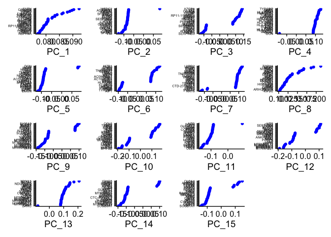
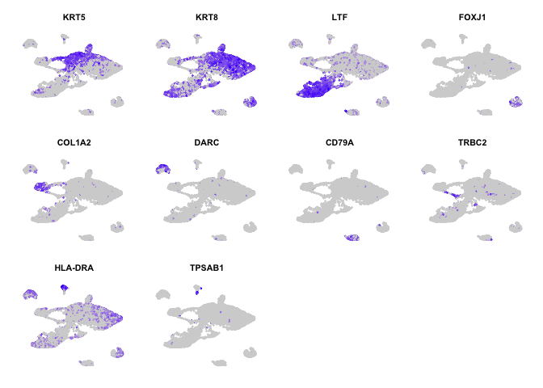

Introduction
---------------

Comparing surgical polyp v no polyp datasets from Jose's 2018 paper
"Allergic inflammatory response"


Chapter 1: Loading data to Seurat
---------------

Load libraries

```r
library(tidyverse)
library(Seurat)
library(Matrix)
```


```r
umifile <- read.csv(file="50ksampPandasGenePolyp.txt",header=TRUE,stringsAsFactors=FALSE)
umidata <- umifile %>% remove_rownames %>% column_to_rownames(colnames(umifile)[1])
rm(umifile)

#load patient information
metadata <- read.csv("../polypMetadata.csv")
#reduce metadata table to data you actually have
metadata2 <- metadata[1:12,]

#filter metadatas by polyp status
Yespolypmeta <- metadata2 %>% filter(polyp=="YES")
Nopolypmeta <- metadata2 %>% filter(polyp=="NO")

#pick out and sparsify data according to polyp status

Yespolypdf <- umidata %>% select(starts_with(Yespolypmeta$orig.ident)) %>% data.matrix %>% Matrix(sparse=TRUE)

Nopolypdf <- umidata %>% select(starts_with(Nopolypmeta$orig.ident)) %>% data.matrix %>% Matrix(sparse=TRUE)

#is there a better way of doing that? Automatically produce dataframe instead of hard coding?

#place data PER PATIENT into preserved named dataframe, make them sparse
#for (i in metadata2[,1])
#  {umidata %>% select(starts_with(i)) -> df
#    df <- df %>% data.matrix %>% Matrix(sparse=TRUE)
#    assign(paste(i,'df',sep=''),df)}

#make whole dataset sparse just in case we want to call it later
umisparse <- umidata %>% data.matrix %>% Matrix(sparse=TRUE)
rm(umidata)

Yespolyp <- CreateSeuratObject(Yespolypdf, project = "polyp_scRNAseq")
Nopolyp <- CreateSeuratObject(Nopolypdf, project = "polyp_scRNAseq")

#look at specific genes in the seurat object
Nopolyp[c("KRT5", "KRT15", "LTF"), 1:30]
```

```
## An object of class Seurat 
## 3 features across 30 samples within 1 assay 
## Active assay: RNA (3 features, 0 variable features)
```

```r
Yespolyp[c("KRT5", "KRT15", "LTF"), 1:30]
```

```
## An object of class Seurat 
## 3 features across 30 samples within 1 assay 
## Active assay: RNA (3 features, 0 variable features)
```

```r
#use [[]] puts a new metadata column to the seurat object
Yespolyp[["percent.mt"]] <- PercentageFeatureSet(Yespolyp, pattern = "^MT-")
Nopolyp[["percent.mt"]] <- PercentageFeatureSet(Nopolyp, pattern = "^MT-")

#look at metadata summaries of seurat object
head(Yespolyp@meta.data, 5)
```

```
##             orig.ident nCount_RNA nFeature_RNA percent.mt
## Polyp1TOT_1  Polyp1TOT       9821         3137   1.293147
## Polyp1TOT_2  Polyp1TOT       9064         2915   2.912621
## Polyp1TOT_3  Polyp1TOT       8293         2517   6.451224
## Polyp1TOT_4  Polyp1TOT      10003         3616   3.668899
## Polyp1TOT_5  Polyp1TOT       8003         2823   1.686867
```

```r
head(Nopolyp@meta.data, 5)
```

```
##             orig.ident nCount_RNA nFeature_RNA percent.mt
## Polyp3TOT_1  Polyp3TOT      20692         5700   1.807462
## Polyp3TOT_2  Polyp3TOT      17784         3432   3.266982
## Polyp3TOT_3  Polyp3TOT      11081         2338   1.308546
## Polyp3TOT_4  Polyp3TOT      14641         2956   2.144662
## Polyp3TOT_5  Polyp3TOT      12593         4466   2.946081
```


```r
#print violin plots of mitochondrial genes
VlnPlot(Yespolyp, features = c("nFeature_RNA", "nCount_RNA", "percent.mt"), ncol = 3)  
```

<!-- -->

```r
VlnPlot(Nopolyp, features = c("nFeature_RNA", "nCount_RNA", "percent.mt"), ncol = 3)
```

<!-- -->

```r
#more QC comparisons
plot1 <- FeatureScatter(Yespolyp, feature1 = "nCount_RNA", feature2 = "percent.mt")
plot2 <- FeatureScatter(Yespolyp, feature1 = "nCount_RNA", feature2 = "nFeature_RNA")
plot1 + plot2
```

<!-- -->

Chapter 2: Normalization
---------------
just using log transform normalization.


```r
Yespolyp <- NormalizeData(Yespolyp, normalization.method = "LogNormalize", scale.factor = 10000)
Nopolyp <- NormalizeData(Nopolyp, normalization.method = "LogNormalize", scale.factor = 10000)
```

Next, we pick out the most variable genes from the dataset.

```r
Yespolyp <- FindVariableFeatures(Yespolyp, selection.method = "vst", nfeatures = 2000)
Nopolyp <- FindVariableFeatures(Nopolyp, selection.method = "vst", nfeatures = 2000)

#what are the top 10?
top10 <- head(VariableFeatures(Yespolyp), 10)

#and plot those highly variable genes with and without labels
plot1 <- VariableFeaturePlot(Yespolyp)
plot2 <- LabelPoints(plot = plot1, points = top10, repel = TRUE)
```

```
## When using repel, set xnudge and ynudge to 0 for optimal results
```

```r
#remove legend from first plot and y-axis shit from second
plot1 + theme(legend.position="none") + plot2 + theme(axis.text.y=element_blank())+ylab("") + scale_y_discrete(breaks=NULL)
```

<!-- -->

```r
#same thing for no polyp dataset
top10 <- head(VariableFeatures(Nopolyp), 10)
plot1 <- VariableFeaturePlot(Nopolyp)
plot2 <- LabelPoints(plot = plot1, points = top10, repel = TRUE)
```

```
## When using repel, set xnudge and ynudge to 0 for optimal results
```

```r
plot1 + theme(legend.position="none") + plot2 + theme(axis.text.y=element_blank())+ylab("") + scale_y_discrete(breaks=NULL)
```

<!-- -->

Chapter 3: Data scaling and visualizing dimensionality reduction
---------------

Seurat uses a "ScaleData" function:
  - shift the expression of each gene so that mean expression across cells is 0
  - scale the expression of each gene, so that the variance across cells is 1


```r
all.genes <- rownames(Yespolyp)
Yespolyp <- ScaleData(Yespolyp, features = all.genes)
```

```
## Centering and scaling data matrix
```

```r
Nopolyp <- ScaleData(Nopolyp, features = all.genes)
```

```
## Centering and scaling data matrix
```

And next, let's perform PCA

```r
Yespolyp <- RunPCA(Yespolyp, features = VariableFeatures(object = Yespolyp))
```

```
## PC_ 1 
## Positive:  DCN, COL1A2, COL3A1, LUM, MGP, CPE, CALD1, FBLN1, COL1A1, SPARC 
## 	   AEBP1, SFRP1, THY1, FGF7, C1S, CRABP2, SFRP2, PCOLCE, NNMT, TAGLN 
## 	   PDGFRA, CDH11, TPM2, KCNE4, CXCL14, CLDN11, SERPING1, COL8A1, COL6A2, PRRX1 
## Negative:  SLPI, MZB1, IGJ, SERPINB3, RGS1, WFDC2, ENAM, DERL3, IGHA1, AGR2 
## 	   CLDN4, CST1, IGHG2, SLAMF7, TSPAN1, IGHG3, IGHG1, AQP3, VMO1, IGHA2 
## 	   KRT18, PIM2, IGKC, S100A2, SERPINB4, AC096579.7, CTSS, FKBP11, KRT8, PIGR 
## PC_ 2 
## Positive:  AIF1, HLA-DPB1, HLA-DPA1, HLA-DQA1, HLA-DRA, HLA-DRB1, TYROBP, MS4A6A, SRGN, FGL2 
## 	   CD74, HLA-DRB5, F13A1, GPR183, IFI30, FCER1G, HLA-DQB1, IL1B, MNDA, CPVL 
## 	   CLEC10A, C1QC, CD83, LAPTM5, HLA-DMB, IGSF6, CD14, MS4A7, CYBB, PLAUR 
## Negative:  SLPI, SERPINB3, TSPAN1, KRT18, AGR2, WFDC2, CLDN4, KRT8, SERPINB4, CST1 
## 	   AQP3, PIGR, VMO1, CXCL17, CP, CAPS, AGR3, C20orf85, CLDN7, C9orf24 
## 	   FAM183A, PIFO, CTD-2319I12.1, S100A2, S100P, MT1X, TPPP3, PTHLH, IGFBP3, SMIM22 
## PC_ 3 
## Positive:  IGJ, MZB1, ENAM, FKBP11, DERL3, IGHG2, IGHG1, AC096579.7, IGHG3, IGHA1 
## 	   IGHG4, SLAMF7, IGHA2, PIM2, IGKC, IGLL1, FCRL5, CD79A, IGLC3, CCND2 
## 	   IGLC7, IGKV3-20, HSP90B1, PRDM1, TNFRSF17, GUSBP11, IGLV3-1, IGLC2, IGLL5, IGKV4-1 
## Negative:  C20orf85, FAM183A, PIFO, C9orf24, SNTN, OMG, TPPP3, AIF1, RP11-356K23.1, AGR3 
## 	   HLA-DRA, LYZ, CST3, HLA-DRB1, HLA-DRB5, HLA-DQA1, HLA-DPB1, TMEM190, ROPN1L, MS4A6A 
## 	   ZMYND10, CAPSL, F13A1, C11orf88, TYROBP, DYDC2, C1orf194, CPVL, HLA-DPA1, TCTEX1D4 
## PC_ 4 
## Positive:  SERPINB3, SERPINB4, S100A2, AQP3, SLPI, MT1X, KRT18, KRT5, KRT8, PTHLH 
## 	   CLDN4, AGR2, CP, IGFBP3, CXCL17, CST1, VMO1, SFN, KRT17, NTS 
## 	   SLC6A14, CTSB, POSTN, WFDC2, CST4, MMP10, TM4SF1, CSTA, KRT15, S100P 
## Negative:  C20orf85, MZB1, SNTN, IGJ, ENAM, C9orf24, OMG, FAM183A, TPPP3, RP11-356K23.1 
## 	   PIFO, DERL3, FKBP11, TMEM190, CAPSL, ROPN1L, ZMYND10, AC096579.7, C9orf116, C1orf194 
## 	   IGHG2, DYDC2, FAM92B, C11orf88, RSPH1, TCTEX1D4, IGHG1, SLAMF7, C5orf49, DNAH12 
## PC_ 5 
## Positive:  SERPINB3, DCN, CST1, LUM, WFDC2, FBLN1, AGR2, SLPI, SFRP1, RARRES1 
## 	   CXCL17, VCAN, COL1A2, CST4, SERPINB4, VMO1, TFF3, CRABP2, TSPAN1, PIGR 
## 	   COL1A1, S100P, LGALS1, CXCL14, CLDN4, CST2, BPIFB1, COL8A1, LYZ, AEBP1 
## Negative:  CLDN5, ELTD1, SPARCL1, DARC, EMCN, PLVAP, ECSCR, ESAM, A2M, APOLD1 
## 	   RAMP2, VWF, AC011526.1, RAMP3, GNG11, NOSTRIN, TSPAN7, CLEC14A, CYYR1, SELE 
## 	   EGFL7, CD34, JAM2, NRN1, CDH5, PALMD, LDB2, NPDC1, GIMAP7, CRIP2
```

```r
Nopolyp <- RunPCA(Nopolyp, features = VariableFeatures(object = Nopolyp))
```

```
## PC_ 1 
## Positive:  SNTN, C20orf85, C9orf24, PIFO, TPPP3, CAPSL, FAM183A, RSPH1, TMEM190, CCDC170 
## 	   SPAG6, OMG, C11orf88, C1orf194, FAM216B, C1orf173, FAM81B, ARMC3, ROPN1L, FAM154B 
## 	   RP11-356K23.1, ZMYND10, DNAH12, C5orf49, C9orf116, DNAH5, TSPAN19, TEKT1, LRRIQ1, RSPH4A 
## Negative:  AZGP1, LTF, C6orf58, TCN1, LYZ, ZG16B, BPIFA1, ODAM, DMBT1, RNASE1 
## 	   PIP, RP11-1143G9.4, PHLDA1, XBP1, CXCL2, CA2, BPIFB1, SLC12A2, ID3, KRT5 
## 	   S100A1, NPDC1, SRGN, LGALS1, SPARC, TM4SF1, VIM, SPARCL1, PPP1R1B, HP 
## PC_ 2 
## Positive:  WFDC2, AGR2, PIGR, CLDN4, KRT8, AQP3, SERPINB3, XBP1, KRT7, VMO1 
## 	   CP, BPIFB1, TSPAN1, CD55, S100P, CLDN7, NTS, ALDH3A1, SERPINB4, GABRP 
## 	   LYPD2, TCN1, MSMB, ALOX15, S100A14, HSPB1, LCN2, NCOA7, SCGB1A1, TMEM213 
## Negative:  VIM, SPARC, IGFBP7, A2M, MGP, CALD1, COL1A2, COL3A1, GNG11, DCN 
## 	   LGALS1, COL15A1, CALCRL, LUM, CXCL12, PTRF, CPE, SERPING1, SFRP2, C1S 
## 	   ELTD1, IFITM3, EMCN, SPARCL1, TIMP3, IGFBP6, IGFBP4, ADAMTS1, FBLN1, PCOLCE 
## PC_ 3 
## Positive:  AZGP1, LTF, LYZ, C6orf58, ZG16B, PIP, TCN1, DMBT1, RP11-1143G9.4, ODAM 
## 	   BPIFA1, BPIFB1, RNASE1, CA2, CCL28, PPP1R1B, PIGR, S100A1, SEC11C, HP 
## 	   PHLDA1, NUCB2, LPO, LRRC26, SSR4, XBP1, FDCSP, F5, GJC3, PRR4 
## Negative:  SERPINB3, AQP3, HSPB1, ALDH3A1, ALOX15, VMO1, S100A4, PRDX1, MT1X, SERPINB4 
## 	   GABRP, IFI27, PMAIP1, AGR2, S100A2, AKR1C3, CLDN4, NTS, FMO3, HPGD 
## 	   RND3, MT1E, S100P, LYPD2, S100A14, KRT5, CLEC2B, KRT8, AKR1C2, ADH7 
## PC_ 4 
## Positive:  TYROBP, AIF1, SRGN, MNDA, HLA-DPA1, HLA-DPB1, MS4A6A, FGL2, RGS1, GPR183 
## 	   LAPTM5, FCER1G, HLA-DQA1, IL1B, HLA-DRA, LST1, HLA-DRB1, CYBB, CD74, HLA-DQA2 
## 	   CCL3, BCL2A1, PLEK, ITGB2, HLA-DQB1, HLA-DRB5, COTL1, AMICA1, CPVL, CXCR4 
## Negative:  DCN, COL1A2, LUM, FBLN1, COL3A1, SFRP2, CPE, C1S, SFRP1, PCOLCE 
## 	   IGFBP6, MGP, MXRA8, RARRES2, SERPING1, COL1A1, CRABP2, FGF7, ITGBL1, CALD1 
## 	   C1R, AEBP1, CLDN11, PDGFRA, INMT, PRRX1, MFAP4, CPXM1, THY1, BGN 
## PC_ 5 
## Positive:  DCN, LUM, RGS1, MZB1, FBLN1, COL1A2, SFRP2, ENAM, LGALS1, IGJ 
## 	   SLAMF7, COL3A1, DERL3, CD79A, PCOLCE, C1S, TNFRSF17, COL1A1, IGFBP6, CRABP2 
## 	   MXRA8, ITGBL1, FGF7, PDGFRA, COLEC12, GLIPR1, SFRP1, CPXM1, MFAP4, VCAN 
## Negative:  EMCN, ELTD1, DARC, VWF, CLDN5, RAMP3, ECSCR, SELE, RAMP2, PLVAP 
## 	   SPARCL1, CLEC14A, GIMAP7, EGFL7, AC011526.1, ESAM, APOLD1, GNG11, NOSTRIN, TSPAN7 
## 	   ENG, ABCB1, TM4SF1, CD34, LIFR, NPDC1, CDH5, TM4SF18, CD93, RNASE1
```

We can visualize PCA in several different ways

First, let's look at the highest contributing genes to each component

```r
VizDimLoadings(Yespolyp, dims = 1:15, reduction = "pca") & theme(axis.text.y = element_text(size=5))
```

<!-- -->

```r
VizDimLoadings(Nopolyp, dims = 1:15, reduction = "pca") & theme(axis.text.y = element_text(size=5))
```

<!-- -->

And we can look at the distribution of cells by the components we like, e.g.

```r
DimPlot(Yespolyp, reduction = "pca")
```

<!-- -->

Or look at heatmaps for the biggest gene contributors across cells

```r
DimHeatmap(Yespolyp, dims = 1, cells = 500, balanced = TRUE)
```

<!-- -->

For any number of components

```r
DimHeatmap(Yespolyp, dims = 1:9, cells = 500, balanced = TRUE)
```

<!-- -->

Chapter 4: How many useful dimensions are in the dataset?
-------------
Seurat uses Macosko et al 2015 method of choosing number of important dimensions,
where PCA is run many times on 1% of the dataset, like bootstrapping.

```r
#run the bootstrap
Yespolyp <- JackStraw(Yespolyp, num.replicate = 100)
Nopolyp <- JackStraw(Nopolyp, num.replicate = 100)
#score the resulting dimensions
Yespolyp <- ScoreJackStraw(Yespolyp, dims = 1:20)
Nopolyp <- ScoreJackStraw(Nopolyp, dims = 1:20)

#and plot distribution of p-values for each component
JackStrawPlot(Yespolyp, dims = 1:20)
```

```
## Warning: Removed 28393 rows containing missing values (geom_point).
```

<!-- -->

```r
JackStrawPlot(Nopolyp, dims = 1:20)
```

```
## Warning: Removed 28014 rows containing missing values (geom_point).
```

<!-- -->

```r
#also create an elbow plot of the variance explained by each component
ElbowPlot(Yespolyp)
```

<!-- -->

```r
ElbowPlot(Nopolyp)
```

<!-- -->

I ran this a few times, and found 7 or 10 or 14 was best. We will go with 10
because there are 10 main cell types defined in the paper:

basal (KRT5 (Peter Lofty presentation subpopulation of basal KRT15))
apical (KRT8)
glandular (LTF)
ciliated (FOXJ1)
fibroblast (COL1A2)
endothelial (DARC/ACKR1)
plasma cell (CD79A)
T cell (TRBC2)
myeloid (HLA-DRA)
mast cell (TPSAB1)

Chapter 5: Clustering the cells with UMAP and t-sne
-------------


```r
Yespolyp <- FindNeighbors(Yespolyp, dims = 1:10)
```

```
## Computing nearest neighbor graph
```

```
## Computing SNN
```

```r
Nopolyp <- FindNeighbors(Nopolyp, dims = 1:10)
```

```
## Computing nearest neighbor graph
## Computing SNN
```

```r
Yespolyp <- FindClusters(Yespolyp, resolution = 0.25)
```

```
## Modularity Optimizer version 1.3.0 by Ludo Waltman and Nees Jan van Eck
## 
## Number of nodes: 11307
## Number of edges: 375379
## 
## Running Louvain algorithm...
## Maximum modularity in 10 random starts: 0.9481
## Number of communities: 12
## Elapsed time: 1 seconds
```

```r
Nopolyp <- FindClusters(Nopolyp, resolution = 0.25)
```

```
## Modularity Optimizer version 1.3.0 by Ludo Waltman and Nees Jan van Eck
## 
## Number of nodes: 7889
## Number of edges: 258839
## 
## Running Louvain algorithm...
## Maximum modularity in 10 random starts: 0.9362
## Number of communities: 10
## Elapsed time: 0 seconds
```

Plot~!

```r
Yespolyp <- RunUMAP(Yespolyp, dims = 1:10)
```

```
## Warning: The default method for RunUMAP has changed from calling Python UMAP via reticulate to the R-native UWOT using the cosine metric
## To use Python UMAP via reticulate, set umap.method to 'umap-learn' and metric to 'correlation'
## This message will be shown once per session
```

```
## 00:35:26 UMAP embedding parameters a = 0.9922 b = 1.112
```

```
## 00:35:26 Read 11307 rows and found 10 numeric columns
```

```
## 00:35:26 Using Annoy for neighbor search, n_neighbors = 30
```

```
## 00:35:26 Building Annoy index with metric = cosine, n_trees = 50
```

```
## 0%   10   20   30   40   50   60   70   80   90   100%
```

```
## [----|----|----|----|----|----|----|----|----|----|
```

```
## **************************************************|
## 00:35:28 Writing NN index file to temp file /var/folders/5c/vpl08snd01q_n45nt4dpmw880000gn/T//RtmppYdeUw/file162261079330
## 00:35:28 Searching Annoy index using 1 thread, search_k = 3000
## 00:35:32 Annoy recall = 100%
## 00:35:33 Commencing smooth kNN distance calibration using 1 thread
## 00:35:34 Initializing from normalized Laplacian + noise
## 00:35:34 Commencing optimization for 200 epochs, with 489532 positive edges
## 00:35:40 Optimization finished
```

```r
Nopolyp <- RunUMAP(Nopolyp, dims = 1:10)
```

```
## 00:35:40 UMAP embedding parameters a = 0.9922 b = 1.112
## 00:35:40 Read 7889 rows and found 10 numeric columns
## 00:35:40 Using Annoy for neighbor search, n_neighbors = 30
## 00:35:40 Building Annoy index with metric = cosine, n_trees = 50
## 0%   10   20   30   40   50   60   70   80   90   100%
## [----|----|----|----|----|----|----|----|----|----|
## **************************************************|
## 00:35:42 Writing NN index file to temp file /var/folders/5c/vpl08snd01q_n45nt4dpmw880000gn/T//RtmppYdeUw/file162238506614
## 00:35:42 Searching Annoy index using 1 thread, search_k = 3000
## 00:35:44 Annoy recall = 100%
## 00:35:44 Commencing smooth kNN distance calibration using 1 thread
## 00:35:45 Initializing from normalized Laplacian + noise
## 00:35:46 Commencing optimization for 500 epochs, with 334324 positive edges
## 00:35:55 Optimization finished
```

```r
DimPlot(Yespolyp, reduction = "umap")
```

<!-- -->

```r
DimPlot(Nopolyp, reduction = "umap")
```

<!-- -->

```r
#to point out where your favorite genes are living
FeaturePlot(Yespolyp, features = c("KRT5", "KRT8", "LTF", "FOXJ1", "COL1A2", "DARC","CD79A","TRBC2","HLA-DRA","TPSAB1")) & NoAxes() & NoLegend() & theme(plot.title = element_text(size=8))
```

<!-- -->

```r
FeaturePlot(Nopolyp,features = c("KRT5", "KRT8", "LTF", "FOXJ1", "COL1A2", "DARC","CD79A","TRBC2","HLA-DRA","TPSAB1")) & NoAxes() & NoLegend() & theme(plot.title = element_text(size=8))
```

<!-- -->

Chapter 6: Mapping known cell types by known markers
-------------

basal (KRT5)
apical (KRT8)
glandular (LTF)
ciliated (FOXJ1)
fibroblast (COL1A2)
endothelial (DARC/ACKR1)
plasma cell (CD79A)
T cell (TRBC2)
myeloid (HLA-DRA)
mast cell (TPSAB1)


```r
new.cluster.ids <- c("Basal", "Plasma Cell", "Apical", "Fibroblast", "T Cell", "More Plasma Cells", "Endothelial", "Myeloid", "Mast Cell", "Ciliated", "Unknown", "Even more plasma cells")
names(new.cluster.ids) <- levels(Yespolyp)
Yespolyp <- RenameIdents(Yespolyp, new.cluster.ids)

DimPlot(Yespolyp, reduction = "umap", label = TRUE, pt.size = 0.5) + NoLegend() + labs(title = "Diseased rhino polyp clusters")
```

<!-- -->

```r
new.cluster.ids <- c("Basal", "Glandular", "Apical", "Fibroblast", "Endothelial", "Ciliated", "Plasma Cell", "Myeloid", "T Cell", "Mast Cell")
names(new.cluster.ids) <- levels(Nopolyp)
Nopolyp <- RenameIdents(Nopolyp, new.cluster.ids)

DimPlot(Nopolyp, reduction = "umap", label = TRUE, pt.size = 0.5) + NoLegend() + labs(title = "Healthy rhino no-polyp clusters")
```

<!-- -->

As in the paper, there is an expansion of basal cells (dense cluster there) and a major loss of glandular cells (they appear in the polyp UMAP as a small cluster somehow undistinguished).


Chapter 7: Finding biomarkers with Seurat
------------

Since our known biomarkers didn't work too well on our UMAP, we can tell Seurat to pick out biomarkers according to contribution to clusters within the UMAP. We'll try that on the polyp set

```r
Yespolyp.markers <- FindAllMarkers(Yespolyp, only.pos = TRUE, min.pct = 0.25, logfc.threshold = 0.25)
```

```
## Calculating cluster Basal
```

```
## Calculating cluster Plasma Cell
```

```
## Calculating cluster Apical
```

```
## Calculating cluster Fibroblast
```

```
## Calculating cluster T Cell
```

```
## Calculating cluster More Plasma Cells
```

```
## Calculating cluster Endothelial
```

```
## Calculating cluster Myeloid
```

```
## Calculating cluster Mast Cell
```

```
## Calculating cluster Ciliated
```

```
## Calculating cluster Unknown
```

```
## Calculating cluster Even more plasma cells
```

```r
#print the best markers
Yespolyp.markers %>% group_by(cluster) %>% top_n(n = 2, wt = avg_logFC)
```

```
## # A tibble: 24 x 7
## # Groups:   cluster [12]
##        p_val avg_logFC pct.1 pct.2 p_val_adj cluster     gene    
##        <dbl>     <dbl> <dbl> <dbl>     <dbl> <fct>       <chr>   
##  1 0.             2.07 0.533 0.102 0.        Basal       MMP10   
##  2 0.             1.78 0.647 0.101 0.        Basal       KRT5    
##  3 0.             3.38 0.755 0.139 0.        Plasma Cell IGKC    
##  4 3.92e-252      3.37 0.314 0.062 1.22e-247 Plasma Cell IGHV1-24
##  5 0.             3.19 0.71  0.157 0.        Apical      BPIFB1  
##  6 9.14e-285      3.38 0.599 0.205 2.84e-280 Apical      BPIFA1  
##  7 0.             3.59 0.92  0.078 0.        Fibroblast  DCN     
##  8 0.             3.11 0.813 0.071 0.        Fibroblast  LUM     
##  9 0.             2.69 0.394 0.036 0.        T Cell      CCL5    
## 10 0.             2.24 0.436 0.029 0.        T Cell      TRBC2   
## # … with 14 more rows
```

```r
#put the gene names in a list
Yespolyp.markers %>% group_by(cluster) %>% top_n(n = 2, wt = avg_logFC) -> test
biomarkers <- unlist(as.list(test$gene))
```


```r
#Display where those genes appear in the cell types of the UMAP
plottop <- FeaturePlot(Yespolyp, features = biomarkers, pt.size=0.25)
plottop & NoAxes() & NoLegend() & theme(plot.title = element_text(size=8))
```

<!-- -->

Not many agree with our known biomarkers. Also, it appears our mast cells may be confused with endothelial.

Finally, display the presence of our biomarkers in cells of each cell type by heatmap

```r
top10 <- Yespolyp.markers %>% group_by(cluster) %>% top_n(n = 10, wt = avg_logFC)
DoHeatmap(Yespolyp, features = top10$gene) + NoLegend()
```

<!-- -->

Chapter 8: Comparing UMAP with t-SNE
------------

Testing t-sne

```r
Yespolyp <- RunTSNE(Yespolyp, dims= 1:10)
Nopolyp <- RunTSNE(Nopolyp, dims= 1:10)
DimPlot(Yespolyp, reduction = "tsne")
```

<!-- -->

```r
DimPlot(Nopolyp,reduction="tsne")
```

<!-- -->

Need to test out Seurat's t-sne parameters.

To save your end plot, run this:

saveRDS(polyp, file = "../polyp_tutorial.rds")


Till next time~
